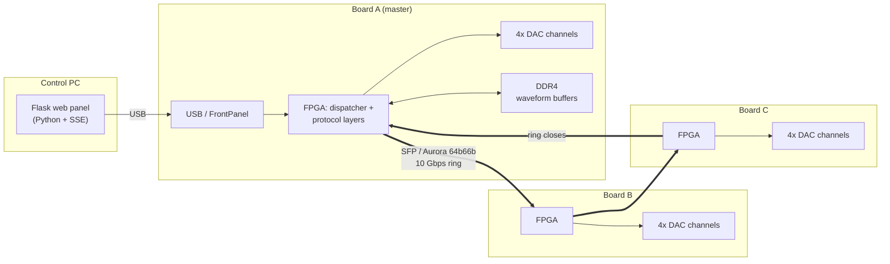

# Multi-Board Synchronized Arbitrary Waveform Generator

A custom FPGA-based AWG system built on Opal Kelly XEM8320 boards, driving up to 4 analog channels per board and synchronizing multiple boards over a 10 Gbps optical ring — with a web control panel for real-time multi-user operation.

## Overview

Each board pairs a Xilinx UltraScale+ FPGA (Opal Kelly XEM8320-AU25P) with 4 Digilent ZmodAWG analog output channels. Multiple boards link over SFP + Aurora 64b/66b (10 Gbps line rate) in a ring topology, so a single trigger can start synchronized playback across every channel on every board at once. Waveforms are streamed from onboard DDR4 and can be anything from a fixed voltage to a precisely-specified single tone to a 1000-tone IFFT-synthesized frequency comb with programmable notches.

A Python/Flask web control panel drives the whole system over USB (talking to every board through the ring, not just the one physically connected), with Server-Sent Events keeping every connected browser in sync in real time. It runs as a permanent embedded control station on a Raspberry Pi 5.

## Highlights

- **Custom 3-layer protocol stack over Aurora 64b/66b** — physical / data / control layers running in parallel over the same RX stream, with a dedicated arbiter merging control and bulk-data TX so control traffic never gets stuck behind a large DDR4 waveform transfer.
- **Ring-topology multi-board sync** — a single broadcast trigger, relayed hop-by-hop around the SFP ring, starts every board's DAC output on the same clock edge. Evolved from a per-trigger broadcast-and-compensate scheme to an arm-once/free-run architecture that eliminates cumulative handshake jitter for repeated triggers.
- **IFFT-based waveform synthesis** — arbitrary frequency combs (up to 1000 tones) computed on the host and streamed to DDR4, with programmable exclude bands (notches) and a joint frequency-search algorithm that gives both the comb spacing *and* any mixed-in single tone independent, verified accuracy guarantees (down to 0 ppm for well-conditioned inputs) instead of a single crude rounding step.
- **Group-based triggering and N-slot rotation** — channels can be assigned to independent trigger groups and scheduled to auto-advance through a sequence of waveform sets on hardware timers, with no host involvement once armed.
- **Web control panel with live multi-client sync** — Flask + vanilla JS, Server-Sent Events broadcast every state change to all connected browsers, deployed as a systemd service with autostart and safe-shutdown hooks (zero-output verification before power-down).

## Architecture



**Protocol stack** (all three layers inspect the same incoming Aurora stream, each claiming only its own packet types):

| Layer | Responsibility |
|---|---|
| Physical | Aurora 64b/66b GT core, SFP link |
| Data | Bulk waveform streaming, generic packet relay |
| Control | Board enumeration, trigger handshake (`PAUSE_REQ → ACK → GO`), resource reservation |

## Getting Started

This repo reflects an active, iterative hardware development process (you'll see dated file variants like `create_bd_linux_cdcfix.tcl` from specific debugging sessions) rather than a polished one-command release. The canonical, current entry points are `vivado/create_bd.tcl` and `vivado/build.tcl` — everything else under `vivado/` is a dated snapshot kept for reference. Board serial numbers, IP addresses, and file paths below are placeholders you'll need to replace with your own.

### Hardware you'll need

- One or more Opal Kelly XEM8320 boards (`xcau25p-ffvb676-2-e`)
- A Digilent ZmodAWG module per board, per analog channel you want
- For multi-board sync: SFP modules + fiber (or a DAC-rate copper cable for single-hop testing) wired into a ring
- A host machine to build/flash from (Vivado needs a real workstation; this project used both Windows and Linux at different points)

### Software prerequisites

- **Xilinx Vivado 2025.2.1** (the UltraScale+ device on this board needs a Vivado version that supports it)
- **Opal Kelly board files for Vivado** — a separate download from Opal Kelly, needed so Vivado recognizes the `opalkelly.com:xem8320-au25p:...` board definition. Either install it into Vivado's global board repository, or point `create_bd.tcl`'s `board.repoPaths` at wherever you unpacked it.
- **Opal Kelly FrontPanel SDK** — ships both the low-level API/IP core (`FrontPanel-Vivado-IP-Dist`, needed by `create_bd.tcl` as a Vivado IP repository) and a Python binding (`ok` module) used by every host script here.
- **Digilent Vivado IP repository** (`ip_Digilent_vivado`) — for the ZmodAWG controller IP core, also referenced by `create_bd.tcl` as an IP repository.
- **Python 3** with `numpy` and `pyusb` (no `requirements.txt` yet — install these manually)
- On Linux, `host/install.sh` automates FrontPanel SDK extraction + udev rules (so you don't need `sudo` every time you plug in a board) + the Python dependencies above

This repo's own `create_bd.tcl` was verified end-to-end (fresh checkout → block design, 0 errors, all warnings matching the project's known-good baseline) with Vivado 2025.2.1 on Linux before publishing.

### 1. Build the bitstream

`vivado/create_bd.tcl` has absolute paths baked in from the original development machines (e.g. `C:/path/to/awg-test-step-16`, `D:/Vivado`). Before sourcing it, update those paths to point at your own checkout and IP locations — the project's own workflow does this with a throwaway `sed` copy rather than editing the canonical file in place:

```bash
sed -e 's#C:/path/to/awg-test-step-16#/your/local/checkout#g' \
    -e 's#D:/Vivado#/wherever/you/put/the/FrontPanel-Vivado-IP-Dist/and/ip_Digilent_vivado/folders#g' \
    -e 's#/path/to/opalkelly/board_repo#/wherever/you/unpacked/opal/kellys/board/files#g' \
    vivado/create_bd.tcl > vivado/create_bd_local.tcl

vivado -mode batch -source vivado/create_bd_local.tcl   # generates the block design
vivado -mode batch -source vivado/build.tcl              # synthesis + implementation + bitstream
```

A clean build produces `awg_step16_bd_wrapper.bit` (see the Vivado log for the exact output path) with 0 DRC errors.

### 2. Flash the board(s)

```bash
python3 host/flash_and_reload.py --list                       # find connected board serials
python3 host/flash_and_reload.py path/to/bitstream.bit --serial <SERIAL>
python3 host/flash_and_reload.py path/to/bitstream.bit --parallel   # flash every connected board at once
```

### 3. Set up the host control machine

```bash
cd host
./install.sh          # Linux only: FrontPanel SDK + udev rules + Python deps
```

`host/awg_common.py` is the single source of truth for the packet protocol and expects the `ok` FrontPanel Python module importable — `install.sh` handles this on Linux; on Windows/macOS, point `sys.path` at wherever you installed the FrontPanel SDK's Python bindings.

### 4. Run the web control panel

```bash
cd host/web
python3 app.py     # serves on http://0.0.0.0:5000
```

Open the printed URL in a browser, click **Initialize System** to enumerate every board on the ring, and you're driving real hardware.

### XEM8320-specific gotchas worth knowing before you start

- **SFP `TX_DISABLE` is not driven by default.** If you bring up the Aurora link over a DAC-rate copper cable first and then switch to real SFP + fiber, don't be surprised when the link refuses to come up — the SFP cage's `TX_DISABLE` pin needs to be explicitly pulled low in your design (`IBUFDS`/`OBUF` + XDC constraint on the right bank; check Opal Kelly's XEM8320 reference documentation for your board's exact SFP pinout).
- **The DAC clock GT quad routing is easy to get wrong.** If you're feeding an external reference clock to the DAC path, it needs to land on a GT-quad-adjacent differential clock pin (`MGTREFCLK*_P/N`) and come in through `IBUFDS_GTE4`, not a generic fabric `IBUFDS` — using the wrong primitive will build and simulate fine and simply never produce a working clock on real hardware.
- **`board_id`/`is_master` should never be sourced from flash.** If you're building a multi-board identity scheme, don't let a board's role persist across power cycles from non-volatile storage — a corrupted or stale value can silently collide with another board's ID. Assign identity explicitly from the host on every boot instead.
- **The Opal Kelly FrontPanel Python binding is not thread/process-safe for concurrent device handles.** Design your host software around one process holding one `USB` handle per physical board at a time.

## Engineering notes

A few of the debugging stories that turned out to matter most:

- **A deadlocking packet router with no error state.** With the optical ring physically open (e.g. testing with a single board), a broadcast packet would leave the router's state machine permanently stuck waiting for a TX handshake that could never come — silently breaking every subsequent command until power-cycled. Traced to the router's `ST_DATA` wait state having no fallback path when the link partner is down; fixed by making link presence part of the state transition condition.
- **A CLI convenience call that could kill a production service.** A low-level helper written for one-shot diagnostic scripts called `sys.exit()` on a transient USB write failure — reasonable for a script, fatal once the same helper got reused inside a long-running Flask server, where it silently killed the entire process on a single bad packet, with no exception for the request handler to catch. Traced by adding diagnostics and reproducing under load; fixed at the source rather than working around it in every caller.
- **Clock-domain crossing gaps that only showed up under real timing pressure.** Several control paths from the system clock domain into the DAC clock domain had no synchronizer at all, working "by accident" while both domains shared a clock source — until an external reference clock made them genuinely asynchronous. Root-caused with an oscilloscope, fixed with the project's standard Xilinx CDC primitives (`xpm_cdc_*`) rather than hand-rolled synchronizers.
- **Frequency accuracy as a joint search, not two independent roundings.** Mixing a fixed single tone with an IFFT-synthesized comb on the same DAC output forces both to share one buffer length — and naively rounding each one separately to fit could leave a tone hundreds of ppm off target. Reframed as a joint search over buffer length for values where *both* signals land on exact frequency grid points, verified end-to-end with an FFT-based spectral regression test (notch depth ≥120 dB below carrier) before ever touching hardware.

## Tech stack

- **RTL**: Verilog / SystemVerilog, Xilinx Vivado, Xilinx XPM CDC primitives
- **Host / control**: Python (Flask, NumPy), vanilla JavaScript + Bootstrap
- **Hardware**: Opal Kelly XEM8320 (Xilinx UltraScale+), Digilent ZmodAWG, SFP optical interconnect
- **Deployment**: systemd service on Raspberry Pi 5, browser-based control panel with real-time multi-client sync
